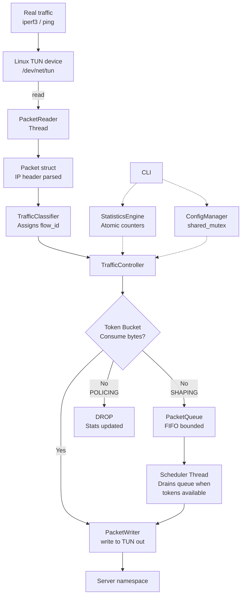

# Architecture Overview

## System Architecture



## Component Responsibilities

| Component | Responsibility |
|---|---|
| `TunDevice` | Opens /dev/net/tun, read()/write() raw IP packets |
| `PacketReader` | Dedicated thread: reads TUN, builds Packet, submits to controller |
| `Packet` | Data struct: size, flow_id, timestamps, IP/port metadata |
| `TrafficClassifier` | Assigns flow_id by matching rules (port, protocol, IP) |
| `TrafficController` | Orchestrates bucket, queue, stats; decides forward/queue/drop |
| `TokenBucket` | Core algorithm: lazy refill, consume, capacity cap |
| `PacketQueue` | FIFO bounded queue with overflow drop and wait-time stats |
| `Scheduler` | Background thread in TrafficController: drains queue when tokens available |
| `StatisticsEngine` | Lock-free atomic counters for all metrics |
| `ConfigManager` | Thread-safe JSON config store with validation |
| `CLI` | Parse CLI args → validate → update ConfigManager → apply_config() |
| `PacketWriter` | Implements ForwardFn: writes allowed packets to output TUN |
| `Logger` | Singleton timestamped logger; thread-safe |

## Thread Architecture

```
main thread
    │ signal handler (atomic flag only)
    │
    ├── PacketReader thread
    │       read() blocks on TUN fd
    │       builds Packet, calls controller.process()
    │
    ├── Scheduler thread (inside TrafficController)
    │       condition_variable: sleeps until queue non-empty
    │       tries to consume tokens for front packet
    │       if tokens available → forward
    │       else → compute sleep time → sleep → retry
    │
    ├── Stats reporting thread (in main)
    │       sleeps stats_interval_ms
    │       reads atomic counters → log
    │
    └── (Phase 15) REST API thread
            accepts HTTP connections
            reads config → responds
```

## Synchronization

| Shared Resource | Protected By | Why |
|---|---|---|
| Token bucket state | `std::mutex` | Two fields (tokens + timestamp) must update atomically |
| Packet queue | `std::mutex` + `std::condition_variable` | Queue struct + wake-up notification |
| Config struct | `std::shared_mutex` | Many readers (packet thread), rare writer (config change) |
| Stats counters | `std::atomic<uint64_t>` | Lock-free hot path; individual counters are independent |
| Shutdown flag | `std::atomic<bool>` | Signal handler → main thread; one writer, multiple readers |
